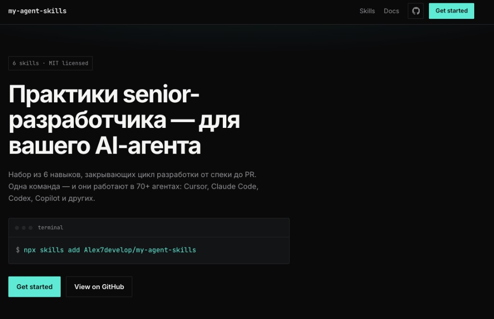

# my-agent-skills

**Практики senior-разработчика — для вашего AI-агента.**

Набор из 6 навыков, закрывающих цикл разработки от спеки до PR. Навыки кодируют процессы, quality gates и привычки, которыми пользуются опытные инженеры — так, чтобы AI-агент следовал им стабильно на каждом этапе.

Формат основан на открытой [Agent Skills specification](https://github.com/vercel-labs/skills). Работает с 70+ агентами: Cursor, Claude Code, Codex, Copilot и другими.



```
  BEFORE CODE              IMPLEMENTATION                    BEFORE MERGE
 ┌────────────┐      ┌──────────────────────────┐      ┌──────────────────┐
 │ Spec First │ ───▶ │ TDD · Debug · Refactor   │ ───▶ │ Review · Commit  │
 │   (спека)  │      │  (код с доказательствами) │      │   / PR (качество) │
 └────────────┘      └──────────────────────────┘      └──────────────────┘
  spec-first          test-driven-development            code-review
                      systematic-debugging               commit-and-pr
                      safe-refactoring
```

| Что делаете | Навык | Ключевой принцип |
|---|---|---|
| Определить, что строить | `spec-first` | Спека перед кодом |
| Написать логику / фикс | `test-driven-development` | Red → Green → Refactor |
| Разобраться в баге | `systematic-debugging` | Причина, а не симптом |
| Упростить структуру | `safe-refactoring` | Поведение не меняется |
| Проверить перед мержем | `code-review` | Пять осей ревью |
| Оформить коммит / PR | `commit-and-pr` | Объяснять «почему» |

Навыки также подключаются автоматически по контексту: новая фича → `spec-first`, «не работает» → `systematic-debugging`, «закоммить» → `commit-and-pr`.

### Slash commands

| Что делаете | Команда | Навык |
|---|---|---|
| Спека перед кодом | `/spec` | `spec-first` |
| Red → Green → Refactor | `/tdd` | `test-driven-development` |
| Системная отладка | `/debug` | `systematic-debugging` |
| Безопасный рефакторинг | `/refactor` | `safe-refactoring` |
| Ревью перед мержем | `/review` | `code-review` |
| Коммит / PR | `/commit` | `commit-and-pr` |

Команды лежат в `commands/` и `.claude/commands/`. Подробнее: [docs/getting-started.md](docs/getting-started.md).

---

## Quick Start

**Самый быстрый путь — одна команда.** Открытая [skills CLI](https://github.com/vercel-labs/skills) ставит навыки в 70+ агентов:

```bash
npx skills add Alex7develop/my-agent-skills --all   # все 6 навыков сразу
npx skills add Alex7develop/my-agent-skills --list  # посмотреть перед установкой
npx skills add Alex7develop/my-agent-skills         # интерактивный выбор
```

Или отдельный навык:

```bash
npx skills add Alex7develop/my-agent-skills --skill code-review
npx skills add Alex7develop/my-agent-skills --skill test-driven-development
npx skills add Alex7develop/my-agent-skills --skill spec-first
```

Неинтерактивно, в конкретного агента (удобно для CI):

```bash
npx skills add Alex7develop/my-agent-skills \
  --skill test-driven-development -a claude-code -y
```

Каталог на [skills.sh](https://skills.sh/Alex7develop/my-agent-skills) · исходники на [GitHub](https://github.com/Alex7develop/my-agent-skills).

---

## Все 6 навыков

Каждый навык — структурированный workflow: шаги, чек-листы и критерии выхода. Можно ставить весь набор или ссылаться на навык напрямую.

### Перед кодом — уточнить, что строить

| Навык | Что делает | Когда использовать |
|---|---|---|
| [spec-first](skills/spec-first/SKILL.md) | Короткая спека: цель, границы, контракт, критерии готовности | Новая фича, значимое изменение, задача с 2+ трактовками |

### Реализация — писать код с доказательствами

| Навык | Что делает | Когда использовать |
|---|---|---|
| [test-driven-development](skills/test-driven-development/SKILL.md) | Red → Green → Refactor, пирамида тестов, поведение вместо реализации | Новая логика, багфикс, изменение поведения |
| [systematic-debugging](skills/systematic-debugging/SKILL.md) | Гипотеза → сужение области → корневая причина, без правок наугад | «Не работает», стектрейс, неожиданное поведение |
| [safe-refactoring](skills/safe-refactoring/SKILL.md) | Маленькие шаги под тестами без смены внешнего поведения | «Упрости», «убери дублирование», рефакторинг без фич |

### Перед мержем — качество и контекст для ревьюера

| Навык | Что делает | Когда использовать |
|---|---|---|
| [code-review](skills/code-review/SKILL.md) | Пять осей: корректность, читаемость, безопасность, производительность, тесты | Перед мержем, ревью PR, проверка своего кода |
| [commit-and-pr](skills/commit-and-pr/SKILL.md) | Атомарные коммиты и описания PR, которые объясняют «почему» | «Закоммить», «оформи PR», завершение задачи |

---

## Как устроены навыки

Каждый навык следует одной анатомии:

```
┌─────────────────────────────────────────────────┐
│  SKILL.md                                       │
│                                                 │
│  ┌─ Frontmatter ─────────────────────────────┐  │
│  │ name: lowercase-hyphen-name               │  │
│  │ description: когда агент должен           │  │
│  │              подключить этот навык…       │  │
│  └───────────────────────────────────────────┘  │
│  Overview     → что делает навык                │
│  When to Use  → триггеры и исключения           │
│  Process      → пошаговый workflow              │
│  Checklist    → критерии готовности             │
└─────────────────────────────────────────────────┘
```

**Принципы набора:**

- **Процесс, не проза.** Навык — workflow с шагами и exit criteria, а не справочник «на почитать».
- **Синхронизация до кода.** `spec-first` дешёво снимает разночтения, пока не написана ни одна строка.
- **Доказательства важнее «кажется ок».** TDD и отладка требуют теста/гипотезы до правки.
- **`description` — это роутер.** Агент решает, подключать ли навык, по frontmatter: формулируйте его с реальными фразами пользователя и без пересечений с соседними навыками.

---

## Структура репозитория

```
my-agent-skills/
├── README.md
├── LICENSE
├── CONTRIBUTING.md
├── AGENTS.md / CLAUDE.md                   # Гайд для агентов в этом репо
├── plugin.json                             # Манифест плагина
├── .claude-plugin/ / .codex-plugin/        # Нативные интеграции
├── .claude/commands/                       # Slash commands (Claude Code)
├── commands/                               # Те же команды (общий формат)
├── skills/                                 # 6 навыков (источник истины)
├── references/                             # Короткие чек-листы
├── docs/                                   # Setup + anatomy + hero
├── scripts/validate-skills.sh              # CI-проверка frontmatter
├── .github/workflows/validate.yml
└── site/                                   # Landing / каталог
```

Почему у [addyosmani/agent-skills](https://github.com/addyosmani/agent-skills) «больше папок»: там 24 навыка, personas, evals, hooks и setup под много инструментов. Этот репозиторий специально компактный — тот же каркас (skills, commands, docs, references, plugins, CI), но под 6 фокусных навыков без лишнего.

---

## Зачем это нужно

AI-агенты по умолчанию идут по короткому пути: пропускают спеку, тесты и ревью — практики, которые делают софт надёжным. Этот набор закрывает shortcut явными процессами.

Каждый навык фиксирует инженерное суждение: *когда* писать спеку, *как* доказывать корректность тестом, *как* искать причину бага, *что* проверять перед мержем и *как* объяснять изменение в коммите/PR. Это не общие промпты — opinionated workflows, которые отделяют production-качество от «прототипа на удачу».

---

## Как расширять

См. [CONTRIBUTING.md](CONTRIBUTING.md) и [docs/skill-anatomy.md](docs/skill-anatomy.md).

```bash
./scripts/validate-skills.sh
```

1. Скопируйте папку из `skills/` как шаблон.
2. Замените `name` / `description` и тело процесса.
3. Убедитесь, что триггеры не пересекаются с соседними навыками.
4. Закоммитьте — навык доступен через `npx skills add`.

---

## Лицензия

[MIT](LICENSE) — используйте эти навыки в своих проектах, командах и инструментах.
